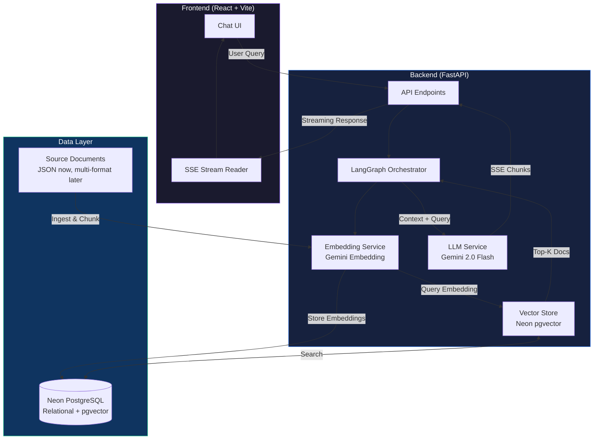

# 🧠 RAG System — Retrieval-Augmented Generation

A full-stack RAG system that retrieves relevant documents from a vector database and generates grounded responses using Google Gemini. Features **LangGraph orchestration**, **strict structured routing/planning/validation**, **SSE streaming**, a **React chat UI**, and a **built-in evaluation framework**.

> Built with FastAPI · LangGraph · Neon PostgreSQL (pgvector) · Google Gemini · React + Vite

> [!NOTE]
> **Reviewers:** This project requires two environment variables (`GEMINI_API_KEY` and `DATABASE_URL`).
> Sandbox credentials will be provided separately. See [Reviewer Notes](#reviewer-notes) for details.

---

## Key Features

- 🔍 **Semantic search** — Gemini embeddings + Neon PostgreSQL (`pgvector`) with HNSW indexing
- 🧭 **LangGraph state machine** — Routed execution: `ingest_query → router → planner → tool_orchestrator → writer → validator → finalize`
- ✅ **Strict structured control nodes** — Schema-enforced Router / Planner / Validator with schema validation + retry
- ⚡ **SSE streaming** — Token-by-token Server-Sent Events with real-time pipeline progress
- 🛡️ **Query guard** — Input normalization, length limits, and safety routing (`direct`, `rag_simple`, `clarify`, `unsafe`)
- 🔄 **Agentic retrieval loop** — Planner-directed `vector_search` + `rerank`, with replan & circuit-breaker fail-safe
- 📊 **Evaluation framework** — Custom LLM judges (Groundedness, Quality), heuristic metrics, CI quality gates
- 🐳 **One-command deploy** — Docker Compose (local) + Cloud Run / Firebase Hosting (production)
- 📈 **Observability** — Prometheus metrics, per-query cost/token tracking, structured observation logs

---

## Architecture



---

## Quick Start

### Docker Compose (Recommended)

```bash
git clone <repo-url> && cd coding-exercise
cp backend/.env.example backend/.env
# Edit backend/.env — set GEMINI_API_KEY and DATABASE_URL

docker-compose up --build
# Backend: http://localhost:8000  |  Frontend: http://localhost:5173

# Ingest the SQuAD corpus (new terminal)
curl -X POST http://localhost:8000/ingest
```

### Local Development

<details>
<summary><strong>Backend (Terminal 1)</strong></summary>

```bash
cd backend
python3 -m venv venv && source venv/bin/activate
pip install -r requirements.txt

cp .env.example .env
# Edit .env — set GEMINI_API_KEY and DATABASE_URL

python scripts/ingest.py          # ingest SQuAD corpus
uvicorn main:app --reload         # http://localhost:8000
```

</details>

<details>
<summary><strong>Frontend (Terminal 2)</strong></summary>

```bash
cd frontend
npm install
npm run dev                       # http://localhost:5173
```

> Vite proxies `/api` → `http://localhost:8000` automatically.
> For direct-backend deployments, set `VITE_API_BASE` at build time.

</details>

---

## Running Tests

All tests run **offline** — no API keys or database required.

```bash
# Backend (from repo root)
cd backend && python3 -m pytest -q

# Frontend
cd frontend && npm test -- --run
```

---

## Evaluation Framework

The project includes a custom evaluation framework in `backend/evaluation/` that replaces heavier libraries like RAGAS with transparent, strict-schema LLM judges and heuristic metrics.

| Component | File | Purpose |
|-----------|------|---------|
| **Runner** | `runner.py` | Automated evaluation engine with retry + exponential backoff |
| **Judges** | `judges.py` | LLM-based Groundedness & Quality judges |
| **Metrics** | `metrics.py`, `retrieval_metrics.py`, `answer_metrics.py`, `perf_metrics.py` | Precision, Recall, MRR, NDCG, latency, cost |
| **Gates** | `check_gates.py` + `gates.yaml` | CI/CD quality gates with strict thresholds |
| **Reports** | `reports/` | JSON artifacts per run (retrieval, answer, latency/cost, failures) |

### Run an Evaluation

```bash
cd backend

# Quick parity check (2 samples)
python -m evaluation.runner --mode full_rag_with_judges --top-k 5 --limit 2

# Full sweep
python -m evaluation.runner --mode full_rag_with_judges --top-k 5
```

### Check Quality Gates

```bash
python -m evaluation.check_gates --scope retrieval   # should pass
python -m evaluation.check_gates --scope full         # may fail on p95 latency — see Known Limitations
```

---

## API Reference

| Method | Path | Description |
|--------|------|-------------|
| `GET` | `/health` | Health check + model/index status |
| `POST` | `/query` | RAG query (JSON response) |
| `POST` | `/query/stream` | RAG query (SSE streaming) |
| `GET` | `/documents` | List indexed documents |
| `POST` | `/ingest` | Start async ingestion job |
| `GET` | `/ingest/{job_id}` | Check ingestion job status |
| `POST` | `/ingest/{job_id}/cancel` | Cancel running ingestion |
| `POST` | `/ingest/{job_id}/retry` | Retry failed ingestion |
| `GET` | `/metrics` | Prometheus metrics |

```bash
# Example query
curl -X POST http://localhost:8000/query \
  -H "Content-Type: application/json" \
  -d '{"query": "Which NFL team won Super Bowl 50?", "top_k": 3}'
```

---

## Tech Stack

| Component | Technology |
|-----------|------------|
| Backend | Python, FastAPI, Uvicorn, LangGraph |
| Vector DB | Neon PostgreSQL + `pgvector` (HNSW, 768-dim) |
| Embeddings | Gemini Embedding (`gemini-embedding-001`) |
| LLM | Google Gemini 2.0 Flash |
| Frontend | React 18, Vite |
| Infra | Docker Compose, Nginx, Cloud Run, Firebase Hosting |

---

## Design Decisions

1. **Neon PostgreSQL + pgvector as a unified store** — One managed database for both relational data and vector search, simplifying deployment and operations.

2. **Gemini Embeddings over sentence-transformers** — Eliminates the ~2 GB PyTorch dependency, keeping Docker images small. Uses `gemini-embedding-001` with `output_dimensionality=768` via the same API key already needed for generation.

3. **SSE over WebSockets** — Simpler to implement, works through proxies, and is the standard for LLM streaming (used by ChatGPT, Claude, etc.).

4. **Custom evaluation over RAGAS** — Lightweight, no heavy dependencies, and more transparent. Each metric is <30 lines and easy to understand.

5. **LangGraph state machine** — Explicit, debuggable control flow with conditional edges and retry paths, instead of implicit chain composition.

---

## Project Structure

```
coding-exercise/
├── backend/
│   ├── main.py                     # FastAPI app — endpoints, lifespan, CORS, Prometheus
│   ├── config.py                   # Pydantic settings from .env
│   ├── database.py                 # SQLModel engine + table creation
│   ├── models.py                   # API request/response schemas
│   ├── models_ingest.py            # Ingestion job & batch DB models
│   ├── models_observability.py     # Query observation DB models
│   ├── models_sql.py               # SQLModel schema definitions
│   ├── Dockerfile                  # Multi-stage backend container
│   ├── deploy.sh                   # Manual Cloud Run deploy script
│   ├── requirements.txt            # Python dependencies (dev)
│   ├── requirements-prod.txt       # Python dependencies (production)
│   ├── .env.example                # Environment variable template
│   ├── services/
│   │   ├── rag.py                  # LangGraph RAG pipeline (router → planner → tools → writer → validator)
│   │   ├── llm.py                  # Gemini LLM client + strict structured output helpers
│   │   ├── embedding.py            # Gemini embedding service (gemini-embedding-001)
│   │   ├── vector_store.py         # Neon PostgreSQL pgvector operations
│   │   ├── query_guard.py          # Input normalization and validation
│   │   └── evaluation_policy.py    # Per-query evaluation policy decisions
│   ├── data/
│   │   ├── ingest.py               # Document chunking & ingestion
│   │   ├── ingest_squad.py         # SQuAD-specific ingestion logic
│   │   ├── verify_ingestion.py     # Post-ingestion verification script
│   │   ├── pipeline/
│   │   │   ├── parser.py           # Source file parsers (SQuAD JSON)
│   │   │   ├── chunker.py          # Text chunking with overlap
│   │   │   ├── manager.py          # Pipeline orchestration & batch processing
│   │   │   └── jobs.py             # Async job queue (create, poll, cancel, retry)
│   │   └── documents/
│   │       └── SQuAD-small.json    # Downsized SQuAD v1.1 corpus (~1.3 MB)
│   ├── evaluation/
│   │   ├── runner.py               # Evaluation engine (retry + backoff)
│   │   ├── judges.py               # LLM-based Groundedness & Quality judges
│   │   ├── metrics.py              # Precision, recall, faithfulness metrics
│   │   ├── retrieval_metrics.py    # Retrieval-specific metrics (MRR, NDCG)
│   │   ├── answer_metrics.py       # Answer-level metric aggregation
│   │   ├── perf_metrics.py         # Latency & cost metrics
│   │   ├── schemas.py              # Evaluation data schemas
│   │   ├── evaluate.py             # CLI entrypoint (alias for runner)
│   │   ├── check_gates.py          # Quality gate checker
│   │   ├── gates.yaml              # Gate thresholds (recall, groundedness, latency, cost)
│   │   ├── datasets/               # Evaluation datasets (.jsonl)
│   │   ├── baselines/              # Baseline metrics for regression detection
│   │   └── reports/                # Generated evaluation reports (JSON)
│   ├── scripts/
│   │   ├── ingest.py               # Helper: trigger & poll ingestion via API
│   │   └── downsize_squad.py       # Helper: create SQuAD-small from full dataset
│   └── tests/                      # 16 test files (pytest) — all run offline
├── frontend/
│   ├── index.html                  # Entry point
│   ├── vite.config.js              # Vite config + API proxy
│   ├── package.json                # Node dependencies
│   ├── Dockerfile                  # Multi-stage build (Vite → Nginx)
│   ├── nginx.conf                  # Nginx config for SPA + API proxy
│   ├── firebase.json               # Firebase Hosting configuration
│   ├── .firebaserc                 # Firebase project binding
│   └── src/
│       ├── main.jsx                # React entry
│       ├── App.jsx                 # Main app + SSE streaming logic
│       ├── App.test.jsx            # App component tests
│       ├── index.css               # Global styles (dark theme)
│       └── components/
│           ├── ChatInterface.jsx   # Message list + empty state
│           ├── Message.jsx         # Individual message rendering
│           ├── QueryInput.jsx      # Auto-resizing textarea input
│           └── SourceDocuments.jsx  # Retrieved sources panel
├── .github/workflows/
│   ├── deploy-backend.yml          # CI/CD: Backend → Cloud Run
│   ├── deploy-frontend.yml         # CI/CD: Frontend → Firebase Hosting
│   ├── eval-backend.yml            # CI: Run evaluation + quality gates
│   └── test-backend.yml            # CI: Run pytest suite
├── docker-compose.yml              # Backend + Frontend orchestration
└── README.md
```

---

## CI/CD

| Workflow | Trigger | What it does |
|----------|---------|-------------|
| `deploy-backend.yml` | Push to `main` (backend changes) | Build → Test → Deploy to Cloud Run |
| `deploy-frontend.yml` | Push to `main` (frontend changes) | Build → Deploy to Firebase Hosting |
| `test-backend.yml` | Push / PR | Run `pytest` suite |
| `eval-backend.yml` | Push / PR | Run evaluation + quality gates |

**Required repository secrets:** `GCP_PROJECT_ID`, `GCP_SA_KEY`, `GEMINI_API_KEY`, `DATABASE_URL`

---

## Reviewer Notes

### Credentials

This project requires two environment variables:

| Variable | Where to get it | Purpose |
|----------|----------------|---------|
| `GEMINI_API_KEY` | [Google AI Studio](https://aistudio.google.com/apikey) (free tier works) | Embeddings + LLM generation |
| `DATABASE_URL` | [Neon](https://neon.tech) (free tier works) | PostgreSQL with `pgvector` |

Sandbox credentials will be provided separately via a private channel. Do not commit secrets to git.

### Reproducibility

| Tier | What it tests | Requires credentials? |
|------|--------------|----------------------|
| **Offline** — `pytest` + `npm test` + `check_gates` on existing reports | Tests, lint, gate logic | ❌ No |
| **Live** — Ingest → Query → Evaluate → Gates | Full end-to-end pipeline | ✅ Yes |

- **Reproducibility contract:** Command behavior is deterministic. LLM text varies run-to-run — compare pass/fail outcomes and metric ranges, not exact wording.

### Known Limitations

1. **p95 latency gate** — The full gate enforces `p95 < 3500ms`. Gemini free-tier latency is ~4000ms, causing the full gate to fail. This is a performance finding, not a correctness bug. Retrieval accuracy and groundedness all pass.

2. **Gemini free-tier rate limits** — Running evaluation with many samples may trigger `429` errors. Use `--limit` to cap sample count, wait 60s between runs, or use a paid API key.
